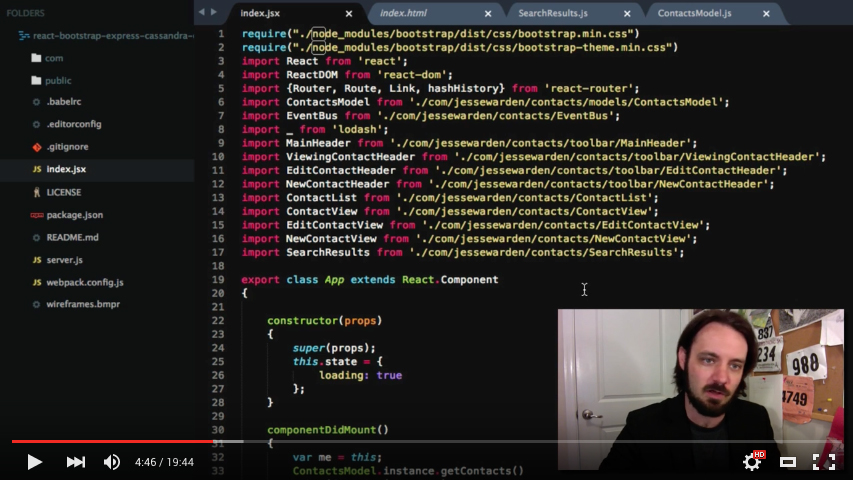

# What
Contacts application written in React, Bootstrap, Node.js's Express, and Cassandra.

Uses [Webpack](http://webpack.github.io/) and [Babel](https://babeljs.io/) via a [starter kit](https://github.com/alicoding/react-webpack-babel).

# Code Walkthrough

# How to Run

- run a Cassandra instance, ensure IP is in `server.js`
- `cd` to directory and run `npm install`
- then run `node server`
- then in a new terminal window, run `npm run dev`
- then open your browser to `http://localhost:8080`
